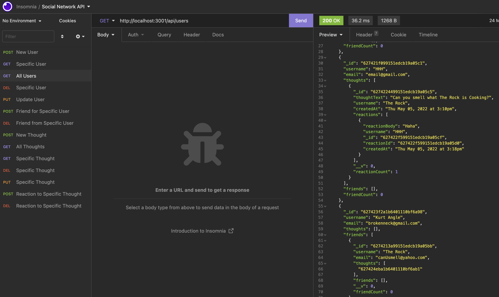
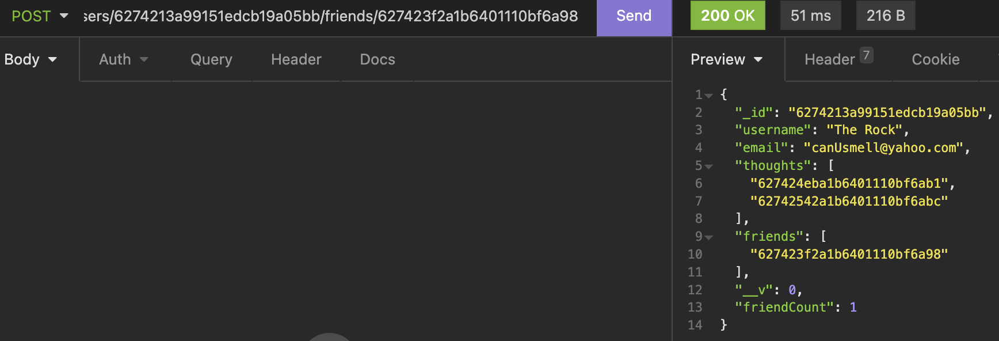
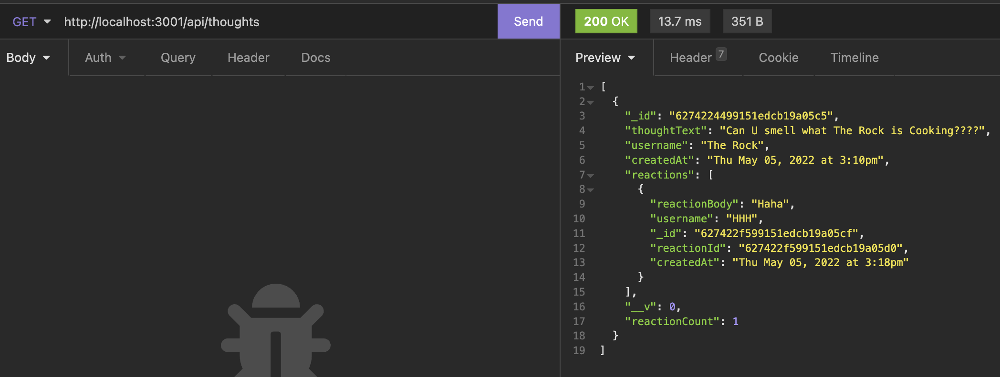

# social-network-api

## Mitchel Wachtel - mitchel.wachtel@gmail.com

---

### Description

This is a back-end application using the Mongo database, mongoose, and express. This app builds a API for a social network. Users can be added, obtained, updated, and deleted. Users can post thoughts about other users, add other users to their friends list, and react to another user's thoughts. All of this is stored in the NoSQL Mongo DB.

---

### Table of contents

- [Installation](#installation)
- [Technology](#technology)
- [Usage](#usage)
- [License](#license)
- [Contributing](#contributing)
- [Tests](#tests)
- [Questions](#questions)

---

### Installation

To install the dependencies necessary to run use the application, the user should run the following command first:

`npm i`

---

### Technology

Technologies used: MongoDB, node.js, npm, Express.js, dependencies: 'mongoose' and 'express'. Routes tested with Insomnia and written on VS Code.

---

### Usage

This application only contains the models, controllers, and routes. The interaction needs to be done through a route-testing app like 'Insomnia'. You must install dependencies ('npm i') for application to be functional. To open the application and begin usage, type "npm start" into the terminal.

Watch *[this video](https://youtu.be/2cX3MZx2oxM)* to see the how using this app works.

---
---
---

---

---

---

### License

Read more about the MIT License _[here](https://opensource.org/licenses/MIT)_.

---

### Contributing

Please contact mitchel.wachtel@gmail.com if you have any desire to contribute to this project.

---

### Tests

No tests are currently set up for this application.

---

### Questions

If you have any questions, please send me an email at mitchel.wachtel@gmail.com and I'll be quick to get back to you! You can also open an issue on GitHub. Find me on GitHub at https://github.com/mitchelwachtel if you are interested in any of my other work.
